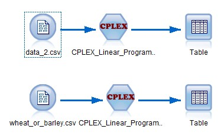
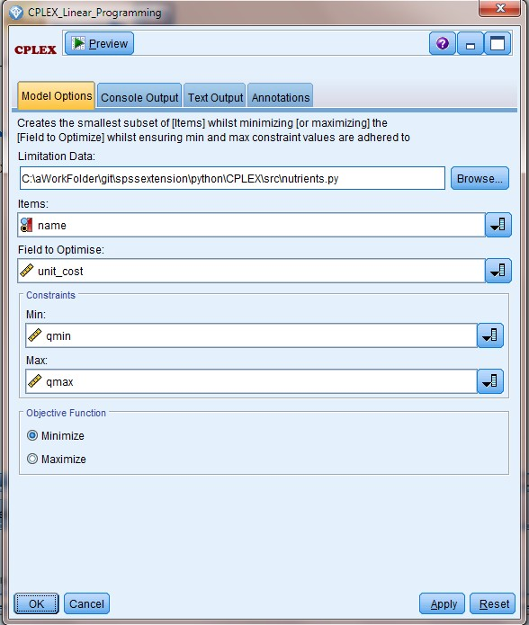

# Simple Linear Programming with CPLEX

IBM ILOG CPLEX Optimizer is a tool for solving linear optimization problems, commonly referred to as Linear Programming (LP) problems.  
The CPLEX Python API is a Python package named cplex that allows the Callable Library to be accessed from the Python programming language. It is equally suitable for interactive use through the Python interpreter or for writing scripts or full-fledged applications.  




---
## Configure CPLEX
This extension dependent on:
 - IBM ILOG CPLEX Optimizer 12.7
 - Python 2.7

Refer to [cplex_instruction.md](cplex_instruction.md) for CPLEX configure.

---
## Limitation Data
Limitation Data provide constrain data for Simple Linear Programming problem.

- Use "LIMITATION" as variable name, and define it with `array`, `tuple`
- Each element define a `name`, `min value`, `max value`
- `name` is the variable name choosed for constrain
- `min`,`max` define constrain variable range

Example:
```
# encoding=utf-8
LIMITATION = [
    ("肥料_Fertilizer", 1, 2500),
    ("农药_Farm_chemical", 1, 1600)
]
```

---
## Requirements

- IBM SPSS Modeler v18
- Anaconda python 2.7

More information here: [IBM Predictive Extensions][2]

---
## Requirements
Python package dependent
- pandas
- collections
- docplex
- json
---
## License

[Apache 2.0][1]

---
## Contributors
- Yu Wenpei [(mail)](yuwenp@cn.ibm.com)

[1]:http://www.apache.org/licenses/LICENSE-2.0.html
[2]:https://developer.ibm.com/predictiveanalytics/downloads/#tab2